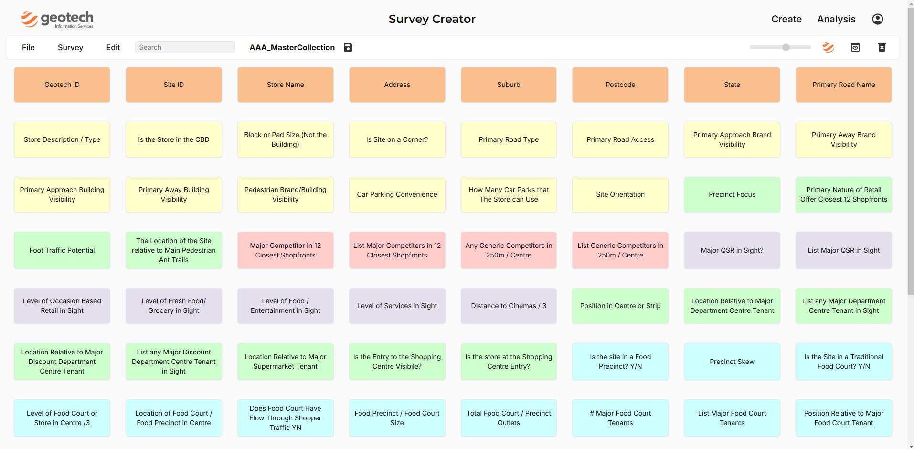
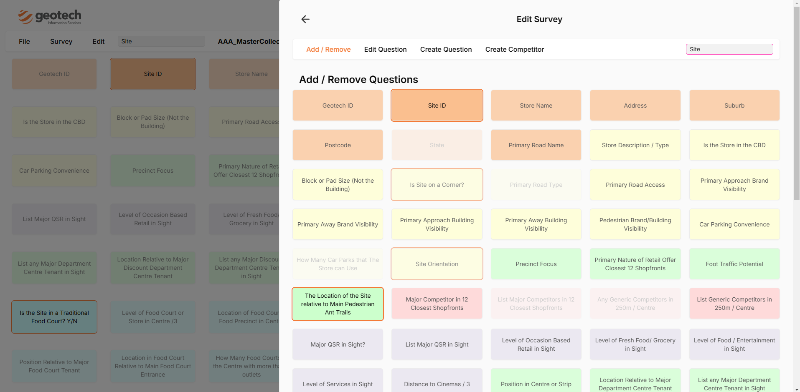
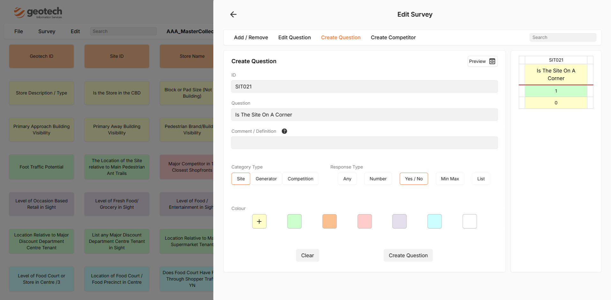
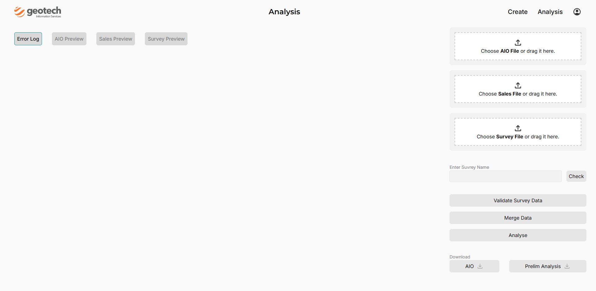

# Geotech Survey Manager

This website assists in building and managing desktop surveys, storing snapshots, performing preliminary analysis on AIO data, and validating survey data for accuracy.

## Table of Contents
1. Features
2. Screenshots
3. Tech Stack
5. Contact

## Features
- **Survey Builder:** Create desktop surveys easily with intuitive tools.
- **Snapshot Management:** Store, manage, and retrieve snapshots of surveys.
- **AIO Data Analysis:** Perform preliminary analysis on AIO data for actionable insights.
- **Data Validation:** Validate survey data to ensure quality and consistency.

## Screenshots
### Overview / Home Page
*The home page, where users can view an overview of the questions within a survey and navigate to different sections.*

&nbsp;

### Add / Remove / Search Question
*This section allows users to add, remove, and search for questions. Use the search bar to quickly find specific questions.*

&nbsp;

### Create New Question
*This section lets users create new questions, with a real-time preview showing how the question will appear in the final Excel survey.*

&nbsp;

### Prelimary Analysis Page
*The Preliminary Analysis page enables users to upload data for initial analysis, validate survey data, and consolidate information into a single AIO file.*

&nbsp;

## Tech Stack
- Frontend: Next.js, React, Tailwind CSS, Danfo, ExcelJS
- Backend: Node.js, Firebase (Firestore database, Authentication)
- Database: Firestore
- Deployment: Vercel

## Contact
- brycep@geotechinfo.com.au

